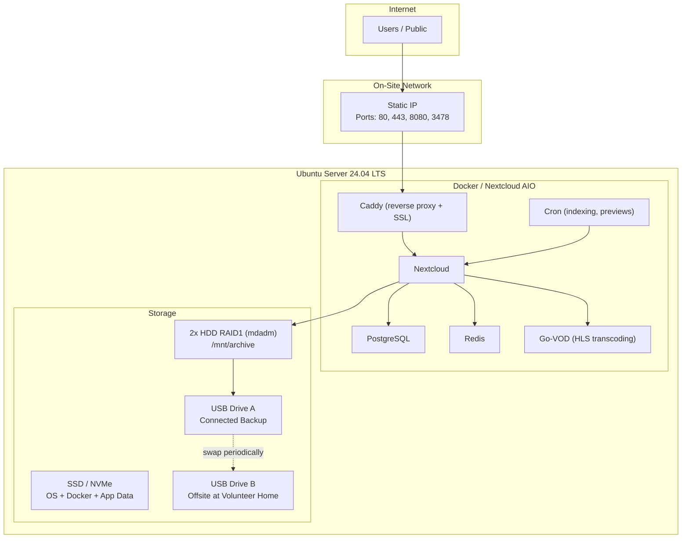

# Steffi Nossen Media Archive -- Build Plan

Consolidated plan for building and deploying a Nextcloud-based media archive for the Steffi Nossen nonprofit, covering OS provisioning, Docker deployment, app configuration, permissions, performance tuning, backup strategy, and operational runbooks.

## 1. Architecture Overview

A self-hosted Nextcloud AIO instance running on Ubuntu Server 24.04 LTS, optimized for folder-based media archiving with role-based access, pre-rendered previews, and adaptive video streaming.



## 2. Hardware Layout

- **Boot drive**: Small SSD or NVMe -- Ubuntu Server 24.04 LTS, Docker engine, Nextcloud AIO system volumes
- **Data drives**: 2x large NAS-grade HDDs in mdadm RAID1, mounted at `/mnt/archive` -- all Nextcloud user data lives here
- **Backup drives**: 2x external USB HDDs for rotating backup (one connected, one offsite)
- **UPS**: Battery backup to prevent corruption during power events
- **RAM**: Enough to support preview generation, search indexing, and concurrent users (16 GB minimum recommended)

Filesystem: ext4 on all volumes.

## 3. Connectivity & SSL

- **Static IP** on the nonprofit's business internet connection
- **Port forwarding**: 80 (HTTP redirect), 443 (HTTPS), 8080 (AIO admin dashboard), 3478 (STUN/Talk)
- **SSL**: Automated via Let's Encrypt, handled by Caddy inside AIO
- **Fallback**: If ISP issues arise, Cloudflare Tunnel is a viable alternative that avoids port forwarding entirely
- **Pre-launch check**: Test actual upload speed from the building -- video playback and remote uploads depend on it

## 4. Nextcloud Folder Structure (Team Folders)

These are the top-level Team Folders that define the archive's browsing experience:

| Folder | Purpose |
|---|---|
| **Public** | Content cleared for public sharing via links |
| **Archive** | Long-term organized archive (by year, event, type) |
| **Uploads** | Intake folders where editors deposit new material |
| **Restricted** | Sensitive content (minors, internal, rights-unclear) |
| **Admin** | Governance docs, backup keys, procedures |

Subfolders within Archive follow a convention like `Archive/YYYY/Event-Name/` or `Archive/YYYY/Type/`.

## 5. Roles & Permissions

Implemented via Team Folders + Files Access Control + group membership:

- **Public**: No account required. Read-only access via password-protected or open share links with expiration dates. Scoped to the `Public` folder only.
- **Viewer** (`viewers-private` group): Logged-in read-only access to Public, Archive, and selected Restricted content. 2FA optional.
- **Editor** (`editors-uploads`, `editors-alumni` groups): Write access to `Uploads` subfolders only. No direct write to Archive. 2FA enforced.
- **Admin** (`admins` group): Full control over all folders, users, shares, backups, shell access. 2FA enforced.

Key principle: editors write to intake folders, not directly to the archive. Admins curate from Uploads into Archive.

## 6. Nextcloud App Stack

### Day 1 -- Foundation

- **Team Folders** -- admin-managed shared folders with per-group permissions
- **Files Access Control** -- rule-based deny for create/modify/delete/download
- **Files Automated Tagging** -- auto-tag by folder, group, or upload context
- **Nextcloud Antivirus** -- scan uploads before writing to storage
- **TOTP 2FA** -- enforced for admins and editors
- **Public share settings** -- password enforcement, expiration enforcement

### Day 2 -- Archive Quality-of-Life

- **Memories** -- timeline browsing, albums, video transcoding, metadata editing
- **Full Text Search + Files** -- index PDFs, docs, program notes
- **MetaVox** -- custom metadata fields (event name, year, photographer, rights status, etc.)
- **AutoRename** -- standardize filenames on upload using rules and EXIF data

### Later -- If Needed

- Workspace (delegated team management)
- Organization Folders (large-org Team Folder management)
- CiviCRM integration (tie media to donor/alumni contacts)
- DocuDesk (publication consent tracking)
- OCR add-on (Tesseract for scanned document search)

## 7. Performance Tuning

- **Memory limit**: `NEXTCLOUD_MEMORY_LIMIT=2048M`
- **Preview Generator**: Pre-render thumbnails via `php occ preview:generate-all`; schedule cleanup
- **Memories indexing**: Cron job for `php occ memories:index` after new content drops
- **Go-VOD**: Enable HLS adaptive streaming inside Memories for dance videos
- **Upload limit**: Raise default from 512 MB -- large video files are expected
- **WebDAV / sync clients**: Document as alternative for bulk uploads

## 8. Backup Strategy (3-2-1, Zero Cloud Cost)

Three copies, two media types, one offsite -- no recurring cloud fees:

1. **Live server** -- RAID1 mirrored HDDs (protects against single drive failure only)
2. **Local USB backup** -- Encrypted backup to an external USB drive always connected to the server, scheduled via AIO's Borg backup or rsync
3. **Offsite USB rotation** -- A second USB drive is kept offsite at a board member's or volunteer's home. Periodically (e.g., monthly), someone swaps the drives: the offsite drive comes in, receives a fresh backup, and the previous on-site drive goes home as the new offsite copy.

Minimum equipment: 2 identical external USB HDDs (large enough to hold the full archive).

### USB Rotation Procedure

1. Volunteer brings offsite drive to the server location
2. Admin plugs it in, runs `backup.sh`, verifies the backup completed
3. Admin unplugs the old on-site drive, hands it to the volunteer to take home
4. The freshly-backed-up drive stays connected as the new on-site backup

### Critical Recovery Items

- PostgreSQL database dump
- `/mnt/archive` data directory
- `config.php`

RAID is not backup. Mirroring protects against a dead drive, not against deletion, ransomware, corruption, or bad edits.

## 9. Security & Privacy

- Firewall (ufw) allowing only forwarded ports
- 2FA enforced for privileged roles
- Antivirus on all uploads
- Public shares: admin-controlled, password + expiration enforced
- **Minors policy**: Decide before launch what can be public. Consider stripping GPS/EXIF metadata from public-facing images.
- Admin audit of share links on a regular schedule

## 10. Repo Structure

```
steffi-nossen-archive/
├── README.md                          # Project overview, quickstart
├── .env.example                       # Template for all config variables
├── docker-compose.yml                 # Nextcloud AIO deployment
│
├── scripts/
│   ├── provision/
│   │   ├── 01-base-setup.sh           # Ubuntu baseline (updates, ufw, essentials)
│   │   ├── 02-raid-setup.sh           # mdadm RAID1 creation, mount at /mnt/archive
│   │   ├── 03-docker-install.sh       # Docker engine + compose plugin
│   │   └── 04-deploy-nextcloud.sh     # Pull and start AIO containers
│   │
│   ├── index-media.sh                 # Memories indexing + Preview Generator cleanup
│   ├── setup-previews.sh              # Configure Preview Generator settings
│   └── backup.sh                      # Trigger backup + verify
│
├── config/
│   └── custom.config.php              # PHP performance overrides
│
└── docs/
    ├── README.md                      # This file (full build plan)
    ├── HARDWARE.md                    # Disk layout, RAM, UPS requirements
    ├── NETWORK.md                     # Static IP, port forwarding, SSL
    ├── PERMISSIONS.md                 # Roles, groups, folder ACLs, share policies
    ├── APPS.md                        # App stack install order and config
    ├── BACKUP.md                      # 3-2-1 strategy, restore procedures
    ├── RUNBOOK.md                     # Day-to-day ops: add users, upgrade, monitor
    └── PRIVACY.md                     # Minors policy, metadata stripping, EXIF
```

## 11. Build Phases

The work is ordered so each phase produces a working (or testable) state before moving on.

### Phase 1 -- Provisioning Scripts + Docs

Write the OS-level setup: base Ubuntu hardening, RAID1 creation, Docker install. Produce `HARDWARE.md` and `NETWORK.md`.

### Phase 2 -- Nextcloud AIO Deployment

Write `docker-compose.yml`, `.env.example`, `custom.config.php`, and the deploy script. Get a bare Nextcloud instance running.

### Phase 3 -- Permissions & Folder Structure

Document and script the Team Folder creation, group setup, and ACL configuration. Produce `PERMISSIONS.md`.

### Phase 4 -- App Stack & Performance

Document app installation order. Write `index-media.sh`, `setup-previews.sh`, and cron configuration. Produce `APPS.md`.

### Phase 5 -- Backup Infrastructure

Write `backup.sh`, configure AIO Borg backup, document USB drive rotation procedure and restore procedures. Produce `BACKUP.md`. No cloud services required.

### Phase 6 -- Operational Runbook & Security Docs

Write `RUNBOOK.md` (user management, upgrades, monitoring), `PRIVACY.md` (minors policy, metadata). Final `README.md` polish.

## Design Decisions

- **Connectivity**: Static IP with port forwarding. Cloudflare Tunnel documented as a fallback if ISP issues arise.
- **Group names**: Specific Nextcloud groups (`viewers-private`, `editors-uploads`, `editors-alumni`, `admins`) rather than generic role labels.
- **App stack**: Phased installation (Day 1 foundation, Day 2 quality-of-life, Later if needed) rather than installing everything at once.
- **Backup**: 3-2-1 via USB drive rotation instead of cloud storage, keeping recurring costs at zero.
- **OS**: Ubuntu Server 24.04 LTS for long-term support (through May 2029) and broad community support.
