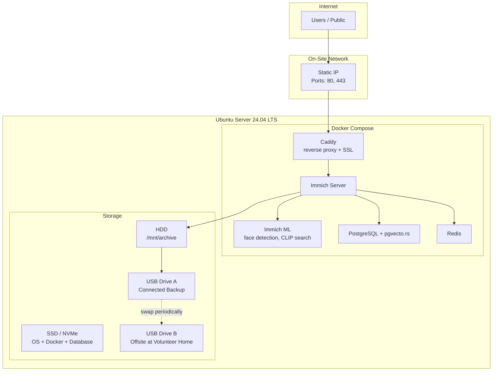

# Steffi Nossen Media Archive -- Build Plan

Consolidated plan for building and deploying an Immich-based photo and video archive for the Steffi Nossen nonprofit, covering OS provisioning, Docker deployment, access control, backup strategy, and operational runbooks.

## 1. Architecture Overview

A self-hosted Immich instance running on Ubuntu Server 24.04 LTS, optimized for photo and video archiving with smart search, face recognition, and role-based access.



## 2. Why Immich Over Nextcloud

The project originally planned to use Nextcloud AIO with the Memories app. After testing, Immich was chosen instead because:

- **Purpose-built for photos/videos**: Immich is a dedicated media platform, not a file server with a photo add-on
- **Superior browsing experience**: Timeline, map view, and album UIs are first-class features
- **Smart search**: CLIP-based search lets you find photos by describing them ("dance recital on stage")
- **Face recognition**: Automatically groups photos by person
- **Simpler deployment**: Fewer moving parts than Nextcloud AIO
- **External Libraries**: Can watch existing folder structures on disk without re-importing

The archive does not need document storage, office suites, or file sync -- only photos and videos.

## 3. Hardware Layout

- **Boot drive**: SSD or NVMe -- Ubuntu Server 24.04 LTS, Docker engine, PostgreSQL data
- **Data drive**: HDD mounted at `/mnt/archive` -- Immich uploads and external library
- **Backup drives**: 2x external USB HDDs for rotating backup (one connected, one offsite)
- **UPS**: Battery backup to prevent corruption during power events
- **RAM**: 16 GB minimum recommended (ML models benefit from more)

If two matching HDDs are available, configure them as mdadm RAID1 for drive failure protection. With a single HDD, USB backups become even more critical.

Filesystem: ext4 on all volumes.

## 4. Connectivity and SSL

- **Static IP** on the nonprofit's business internet connection
- **Port forwarding**: 80 (HTTP redirect), 443 (HTTPS)
- **SSL**: Automated via Let's Encrypt through a Caddy reverse proxy
- **Fallback**: If ISP issues arise, Cloudflare Tunnel is a viable alternative
- **Pre-launch check**: Test actual upload speed from the building

## 5. Roles and Permissions

Immich uses a simpler permission model than Nextcloud. There are no "group folders" or ACLs -- access is managed through user accounts, shared albums, and public links.

- **Public**: No account required. View-only access via password-protected or open shared links with expiration dates.
- **Viewer**: Registered user account. Can browse shared albums. Cannot upload or modify.
- **Editor**: Registered user account. Can upload photos/videos to their own library. Admins share relevant albums with them.
- **Admin**: Full control over all users, libraries, settings, and server configuration. The first account created becomes admin.

Key principles:
- Editors upload to their own library; admins curate into shared albums
- Public access is handled via shared links (no account needed)
- External Libraries let admins expose existing folder structures without re-uploading

## 6. Immich Features Used

- **Timeline**: Browse the full archive chronologically
- **Albums**: Curated collections by event, year, or theme
- **Shared Albums**: Collaborate with specific users; viewers get read-only access
- **Shared Links**: Public URLs (optionally password-protected, with expiration) for external sharing
- **External Libraries**: Watch folders on the local HDD -- existing organized folder structures appear in Immich without re-importing
- **Face Recognition**: Automatically groups photos by person (can be disabled in admin settings if the organization requires it)
- **CLIP Search**: Find photos by natural language description
- **Map View**: Browse photos by location (if GPS metadata is present)
- **Video Transcoding**: Automatic transcoding for web playback

## 7. Backup Strategy (3-2-1, Zero Cloud Cost)

Three copies, two media types, one offsite -- no recurring cloud fees:

1. **Live server** -- HDD (or RAID1 if two HDDs)
2. **Local USB backup** -- External USB drive connected to the server, receiving scheduled backups
3. **Offsite USB rotation** -- Second USB drive kept at a volunteer's home, swapped periodically

### What Gets Backed Up

- PostgreSQL database dump (user accounts, metadata, albums, face data)
- Upload directory (`/mnt/archive/immich-uploads`)
- External library (`/mnt/archive/external`)

### USB Rotation Procedure

1. Volunteer brings offsite drive to the server location
2. Admin runs `backup.sh`, verifies completion
3. Admin unplugs the old on-site drive, hands it to the volunteer
4. The freshly backed-up drive stays connected as the new on-site backup

## 8. Security and Privacy

- Firewall (ufw) allowing only ports 22, 80, 443
- Strong admin password; consider sharing admin credentials with a second trusted person
- Public shares: admin-controlled, password + expiration recommended
- **Minors policy**: Decide before launch what can be shared publicly. Consider stripping GPS/EXIF metadata from public-facing images.
- Face recognition can be disabled globally if the organization has concerns about biometric data

## 9. Repo Structure

```
steffi-nossen-archive/
├── README.md                      # Project overview, quickstart
├── .env.example                   # Template for all config variables
├── docker-compose.yml             # Immich production (with Caddy SSL)
├── docker-compose.local.yml       # Local testing (no SSL, no domain)
├── docker-compose.immich-test.yml # Quick throwaway test instance
│
├── scripts/
│   ├── provision/
│   │   ├── 01-base-setup.sh       # Ubuntu baseline (updates, ufw, essentials)
│   │   ├── 02-raid-setup.sh       # mdadm RAID1 creation, mount at /mnt/archive
│   │   ├── 02a-raid-recover.sh    # Detect existing RAID (machine swap)
│   │   ├── 03-docker-install.sh   # Docker engine + compose plugin
│   │   └── 04-deploy-immich.sh    # Pull and start Immich containers
│   │
│   └── backup.sh                  # Database dump + rsync to USB
│
└── docs/
    ├── README.md                  # This file (full build plan)
    ├── QUICKSTART.md              # Local testing guide (start here!)
    ├── HARDWARE.md                # Disk layout, RAM, UPS requirements
    ├── NETWORK.md                 # Static IP, port forwarding, SSL
    ├── PERMISSIONS.md             # Roles, shared albums, external libraries
    ├── BACKUP.md                  # 3-2-1 strategy, restore procedures
    ├── RUNBOOK.md                 # Day-to-day ops: users, upgrades, monitoring
    └── PRIVACY.md                 # Minors policy, metadata stripping, EXIF
```

## 10. Build Phases

### Phase 1 -- Provisioning Scripts and Docs

Write the OS-level setup: Ubuntu hardening, storage mount, Docker install. Produce `HARDWARE.md` and `NETWORK.md`.

### Phase 2 -- Immich Deployment

Write `docker-compose.yml`, `.env.example`, and the deploy script. Get a bare Immich instance running with Caddy SSL.

### Phase 3 -- Permissions and Access

Create user accounts, configure shared albums, set up external libraries, and configure public sharing policies. Produce `PERMISSIONS.md`.

### Phase 4 -- Backup Infrastructure

Write `backup.sh`, document USB drive rotation and restore procedures. Produce `BACKUP.md`.

### Phase 5 -- Operational Runbook and Privacy Docs

Write `RUNBOOK.md` (user management, upgrades, monitoring), `PRIVACY.md` (minors policy, metadata). Final `README.md` polish.

## Design Decisions

- **Platform**: Immich instead of Nextcloud -- purpose-built for photos/videos, simpler deployment, better browsing UX.
- **Connectivity**: Static IP with port forwarding. Cloudflare Tunnel documented as a fallback.
- **Roles**: Generic names (Public, Viewer, Editor, Admin) mapped to Immich's user and sharing model.
- **Backup**: 3-2-1 via USB drive rotation instead of cloud storage, keeping recurring costs at zero.
- **OS**: Ubuntu Server 24.04 LTS for long-term support (through May 2029) and broad community support.
- **Face Recognition**: Enabled by default, but documented as disableable if the organization requires it.
